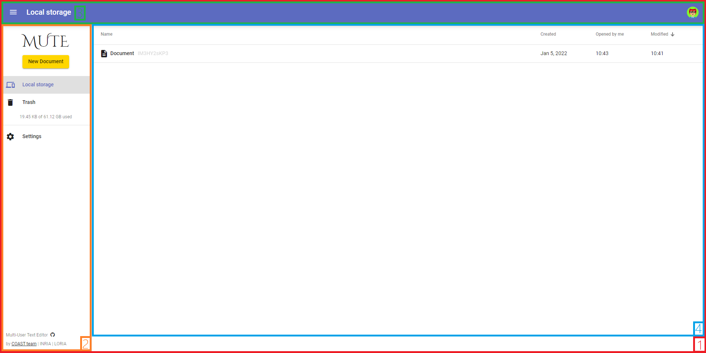
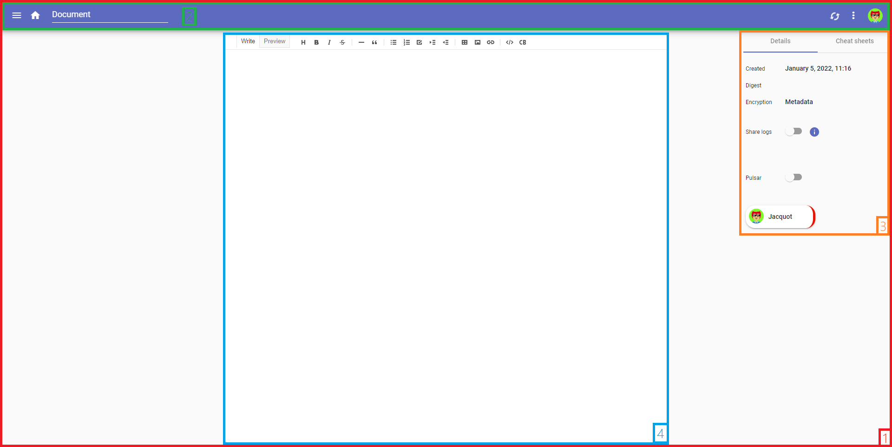

# **Mute - A quick tour of the project**
## Table of content
- [**Mute - A quick tour of the project**](#mute---a-quick-tour-of-the-project)
  - [Table of content](#table-of-content)
  - [## **From a functional Point Of View**](#-from-a-functional-point-of-view)
    - [How does it work](#how-does-it-work)
    - [Different modules for different usage](#different-modules-for-different-usage)
  - [## **From a technical Point Of View**3](#-from-a-technical-point-of-view3)
    - [UI and corresponding files](#ui-and-corresponding-files)
      - [Principal page](#principal-page)
      - [Edit Page](#edit-page)

---
## ***From a functional Point Of View***
---
### How does it work
Peer-to-Peer collaborative editing application relying on the newest technology.

### Different modules for different usage
- **Mute-structs** is an implementation of the LogootSplit CRDT algorithm. It is used to ensure consistency on replicated text sequences. 
The code is accessible [here](https://github.com/coast-team/mute-structs).
- **Mute-crypto** is used to encrypt the message sent through the P2P network.
The code is accessible [here](https://github.com/coast-team/mute-crypto)
- **Mute-auth-proxy** assign public/private key pairs to authenticated users. This module works with Mute-crypto.
The code is accessible [here](https://github.com/coast-team/mute-auth-proxy)
- **Netflux** manage the P2P network. It ensures . The code is accessible [here](https://github.com/coast-team/netflux).

### Mute schematized as of the end of 2021

---
## ***From a technical Point Of View***
---
### UI and corresponding files

#### Principal page

- 1 -> The page is being stored here : `src/app/app.component.spec.ts`
- 2 -> The navbar is stored here : `src/app/shared/nav/nav.component.html`
- 3 -> The toolbar is stored here : `src/app/docs/toolbar.component.html`
When you click on the avatar, the page opened is stored here : src/app/shared/profile/profile.component.html
- 4 -> The documents listing page is stored here : src/app/docs/docs.component.html

***Other informations :*** 
- The page shown (with the 4 squares fading) when Mute is loading is stored here : `src/index.html`
- The dialog page (pop-up when you click on any button other than New Document) are stored in `src/app/shared/dialogs`

#### Edit Page

- 1 -> The page is still being stored here : `src/app/app.component.spec.ts`
- 2 -> The toolbar is stored here : `src/app/docs/toolbar.component.html`
When you click on the avatar, the page opened is stored here : `src/app/shared/profile/profile.component.html`
The page opened when you click on the three dots on the toolbar is stored here : `src/app/doc/toolbar/toolbar.component.html`
- 3 -> The Details and CheatSheets are stored here : `src/app/doc/right-side`
- 4 -> The document editor is stored here : `src/app/doc/editor/editor.component.html`. The Editor shown here is from CodeMirror.

####Storage
Where are the document stored ? This application doesn't rely on any server so all of the documents are stored locally on the peer side.The documents are stored in an IndexedDB. 
*What is an IndexedDB ? :*
A way to store data persistantly through a web browser. 
The usage here is to be able to encrypt the data so it's not stored in clear on the client side.

